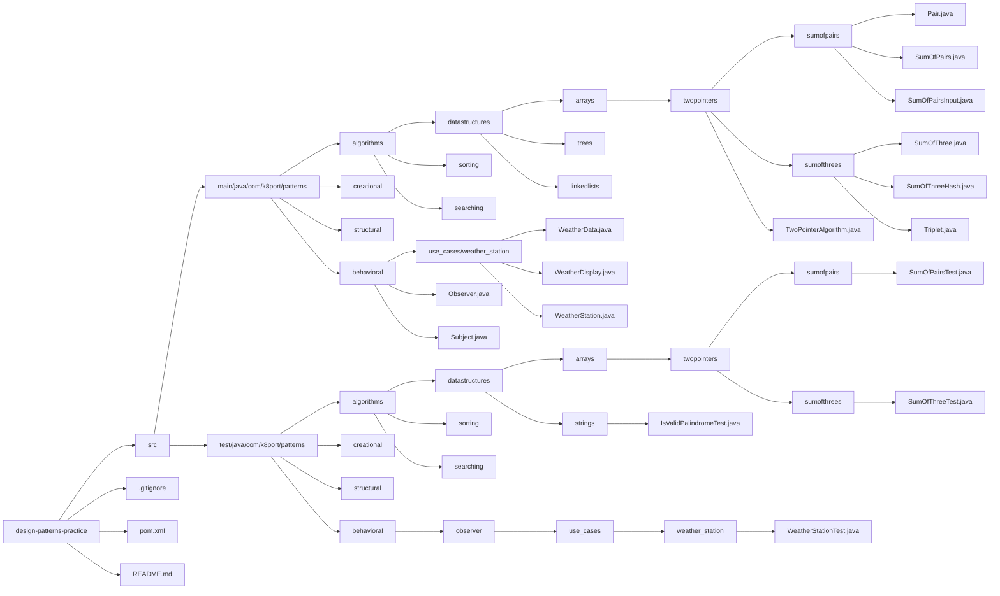

------------------
title: Repository Structure
------------------

```mermaid

flowchart LR
    ROOT[design-patterns-practice] --> BSRC[src]
    BSRC --> CMAIN[main/java/com/k8port/patterns]
    CMAIN --> MAINALG[algorithms]
    MAINALG --> MAINALGDATA[datastructures]
    MAINALGDATA --> MAINALGDATAARR[arrays]
    MAINALGDATAARR --> MAINALGDATAARR2P[twopointers]
    MAINALGDATAARR2P --> MAINALGDATAARR2PSUM2[sumofpairs]
    MAINALGDATAARR2PSUM2 --> MAINALGDATAARR2PSUM2PAIR[Pair.java]
    MAINALGDATAARR2PSUM2 --> MAINALGDATAARR2PSUM2ALG[SumOfPairs.java]
    MAINALGDATAARR2PSUM2 --> MAINALGDATAARR2PSUM2INP[SumOfPairsInput.java]
    MAINALGDATAARR2P --> MAINALGDATAARR2PSUM3[sumofthrees]
    MAINALGDATAARR2PSUM3 --> MAINALGDATAARR2PSUM3SUM3[SumOfThree.java]
    MAINALGDATAARR2PSUM3 --> MAINALGDATAARR2PSUM3HASH[SumOfThreeHash.java]
    MAINALGDATAARR2PSUM3 --> MAINALGDATAARR2PSUM3TRIP[Triplet.java]
    MAINALGDATAARR2P --> MAINALGDATAARR2PLALG[TwoPointerAlgorithm.java]
    MAINALGDATA --> MAINALGDATATREE[trees]
    MAINALGDATA --> MAINALGDATALIST[linkedlists]
    MAINALG --> MAINALGSORT[sorting]
    MAINALG --> MAINALGSRCH[searching]
    CMAIN --> MAINCRE[creational]
    CMAIN --> MAINSTR[structural]
    CMAIN --> MAINBEH[behavioral]
    MAINBEH --> MAINBEHUC[use_cases/weather_station]
    MAINBEHUC --> MAINBEHUC1[WeatherData.java]
    MAINBEHUC --> MAINBEHUC2[WeatherDisplay.java]
    MAINBEHUC --> MAINBEHUC3[WeatherStation.java]
    MAINBEH --> MAINBEHOBS[Observer.java]
    MAINBEH --> MAINBEHSUB[Subject.java]
    BSRC --> CTEST[test/java/com/k8port/patterns]
    CTEST --> TESTALG[algorithms]
    TESTALG --> TESTALGDATA[datastructures]
    TESTALGDATA --> TESTALGDATAARR[arrays]
    TESTALGDATAARR --> TESTALGDATAARR2P[twopointers]
    TESTALGDATAARR2P --> TESTALGDATAARR2PSUM2[sumofpairs]
    TESTALGDATAARR2PSUM2 --> TESTALGDATAARR2PSUM21[SumOfPairsTest.java]
    TESTALGDATAARR2P --> TESTALGDATAARR2PSUM3[sumofthrees]
    TESTALGDATAARR2PSUM3 --> TESTALGDATAARR2PSUM31[SumOfThreeTest.java]
    TESTALGDATA --> TESTALGDATASTR[strings]
    TESTALGDATASTR --> TESTALGDATASTR1[IsValidPalindromeTest.java]
    TESTALG --> TESTALGSORT[sorting]
    TESTALG --> TESTALGSRCH[searching]
    CTEST --> TESTCRE[creational]
    CTEST --> TESTSTR[structural]
    CTEST --> TESTBEH[behavioral]
    TESTBEH --> TTBHOBS[observer]
    TTBHOBS --> TTBHOBSUC[use_cases]
    TTBHOBSUC --> TTBHOBSUCW[weather_station]
    TTBHOBSUCW --> TTBHOBSUCWI[WeatherStationTest.java]
    ROOT --> BGIG[.gitignore]
    ROOT --> BPOM[pom.xml]
    ROOT --> BRME[README.md]
```