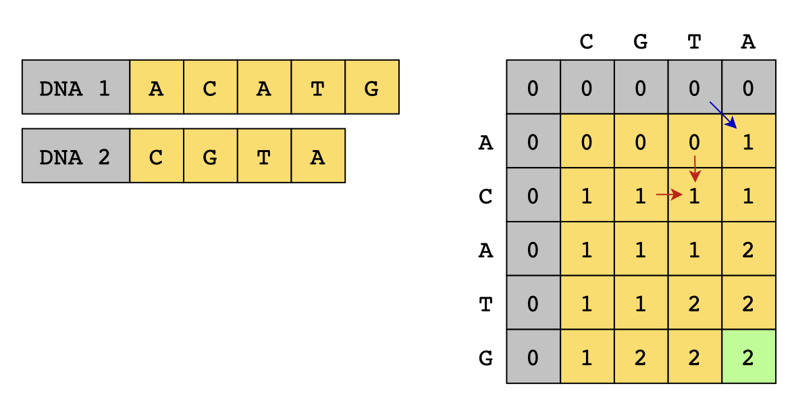

= Dynamic Programming
:icons: font

[Overview of Dynamic Programming%collapsible]
Many computational problems are solved recursively by applying divide-and-conquer strategy. In some of these problems, an `optimal substructure` property exists, where an optimal solution can be constructed from optimal solutions of its subproblems.

.Example Dynamic Programming Problem: Is the String a Palindrome?
====
Start by observing the first and last characters: if they match we can conclude the string might be a palindrome. As we move towards the center of the string, we can repeat this process to check if the inner substrings are also palindromes. For any subproblem where the first and last characters do not match, we can conclude that the string is not a palindrome.
====

.Example Dynamic Programming Problem: Fibonacci Sequence
====
The Fibonacci sequence is a series of numbers where each number is the sum of the two preceding ones, starting from 0 and 1. The subproblem of fib(4) is the sum of fib(3) and fib(2). Each subproblem involves overlapping subproblems, where the solution to fib(3) is used in the solution to fib(4). An optimization would be to store and reuse solutions to subproblems, reducing time complexity from exponential to polynomial time. 
====

***

[discrete]
=== Storing and Reusing Subproblem Solutions

Two approaches to save computations by reusing previous calculations:

1. Top-Down Dynamic Programming (Memoization)
2. Bottom-Up Dynamic Programming (Tabulation)

.Top-Down Dynamic Programming (Memoization)
====
Memoization is implements as enhancement of naive recursive solution, using recursion to break down larger problems into smaller subproblems.  The smallest subproblem is solved and stored in a lookup table.
====

.Bottom-Up Dynamic Programming (Tabulation)
====
Tabulation is iterative approach that builds up solution from smaller subproblems. `dp[i]` represents the optimal solution for subproblem `i`. This approach iterates progressively upward to reach the final solution.
====

***

.Example DP Problem: Maximum Matching Genetic Code
====
Given 2 DNA structures with nucleotide bases, e.g., Adenine (A), Guanine (G), Cytosine \(C), and Thymine (T), find the length of maximum matching between both structures.

*Subproblems*: Find length of maximum matching genetic codes for subsequences of given DNAs.

*Base Cases*: To handle cases where one or both subsequences are empty, initialize 1st row and column of table with 0s, establishing base cases.

*Matching Nucleotide Bases*: When matching nucleotide bases found, extend length of matching matching genetic codes by one.

*Non-Matching Nucleotide Bases*: When non-matching nucleotide bases found, take maximum value from left or above cell - whichever is optimal.

*Iterative Process*: Proceed iteratively, populating each cell in table based on matching or non-matching solutions to subproblems.

*Closure*: Explores all possible subsequence, leading to calculation of length of maximum matching genetic codes.

.Maximum Matching Genetic Code

====

***

== Characteristics of Dynamic Programming Technique
***
:tip-caption: 💡
ifdef::env-github[]
:tip-caption: :bulb:
endif::env-github[]
ifdef::env-asciidoctor[]
:tip-caption: :bulb:
endif::env-asciidoctor[]

TIP: Use pattern when problem matches criteria outlined below.

[unordered]
*Overlapping Subproblems*:: [.small]#Subproblems share overlapping subproblems.#
*Optimal Solution*:: [.small]#Solution to larger problem can be derived from solutions to smaller subproblems.#
***

== Problems Solved Using Dynamic Programming Technique
[unordered]
link:0/1Knapsack.java[0/1 Knapsack]:: [.small]#finding maximum value of items that can be carried in a knapsack of limited capacity.#
link:CoinChange.java[Coin Change]:: [.small]#finding minimum number of coins to make change for a given amount.#
link:N-thTribonnaciNumber.java[N-th Tribonnaci Number]:: [.small]#finding n-th tribonnaci number.#
link:PartitionEqualSubsetSum.java[Partition Equal Subset Sum]:: [.small]#checking if subset of array can be partitioned into two subsets with equal sum.#
link:CountingBits.java[Counting Bits]:: [.small]#counting number of 1s in binary representation of number.#
link:01Matrix.java[01 Matrix]:: [.small]#finding distance of nearest 0 for each cell in matrix.#
link:HouseRobberII.java[House Robber II]:: [.small]#finding maximum amount of money that can be robbed from a list of houses without robbing two adjacent houses.#

== Real World Applications of Dynamic Programming Technique
[unordered]
*Optimal route planning in GPS navigation systems*:: [.small]#Analyzes factors like distance, traffic, and road conditons and evaluates options. Iteratively explores all possible paths to determine optimal route, minimize travel time and avoid congestion.#
*Text Justification*:: [.small]#Determines optimal arrangement of letters and words within lines so that text fits specified width while minimizing whitespace and enhancing readability. Iteratively considers line breaks and evaluates associated costs to find optimal arrangement.#
*Robotics Motion Planning*:: [.small]#Pathfinding and trajectory optimization on robotics designed to navigate through complex environments while minimizing energy consumption, avoiding obstacles, and reaching target destinations efficiently.#