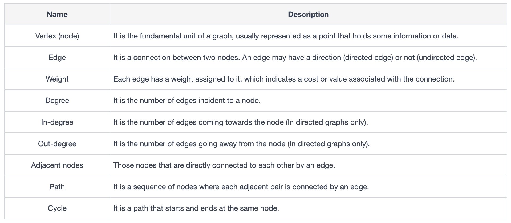

= Graphs
:icons: font

[Overview of Graphs Pattern%collapsible]
Graphs are non-linear data structures used to represent connections or relationships between entities.  In graph theory, entities are represented as vertices (nodes) and connections between them are expressed as edges.

.Properties of Graphs
====
.Table of Graph Properties

====

[discrete]
== Types of Graphs
[unordered]
*Directed Graph*:: [.small]#Edges have direction and indicate flow of data.#
*Undirected Graph*:: [.small]#Edges have no direction and indicate relationship without specific flow.#
*Weighted Graph*:: [.small]#Edges have value that represent cost or distance between vertices.#
*Cyclic Graph*:: [.small]#Edges form cycle, indicating multiple paths between vertices.#
*Acyclic Graph*:: [.small]#Edges do not form cycle, preventing multiple paths between vertices.#

[discrete]
== Graph Representation
[unordered]
*Adjacency Matrix*:: [.small]#2D array representing edges between nodes. `matrix[i][j]` is edge between node `i` and node `j`. A value of 1 indicates an edge of unweighted graph, or value of edge weight if weighted.#
*Adjacency List*:: [.small]#Collection of lists with each list corresponding to a graph node and its neighbors. In case of weighted graph, list elements also contain weight values.#

[discrete]
== Graph Traversals
Solving problems related to graphs requires knowledge of graph traversal techniques.

[unordered]
*Breadth-First Search (BFS)*:: [.small]#Explores all nodes at current depth prior to moving on to nodes at next depth level.#
*Depth-First Search (DFS)*:: [.small]#Explores path all the way to a leaf node before backtracking.#

.Depth-First Search (DFS)
====
Strategy involves exploring as far as possible along one path before turning back. Starts with chosen source node and proceeds to a neighboring node and tracking it as `visited`. Proceeds to a different neighbor and marks `visited`. This continues until it reaches a node with no neighbors. Now, the algorithm starts backtracking. In backtracking, the algorithm goes one step back and checks for the remaining neighbor nodes that are yet to be explored. This process continues until all the nodes in the graph, that are reachable from the source node, have been visited.

.DFS Steps
1. Choose source node and mark "visited".
2. Proceed to source node's first neighbor and mark "visited".
3. Proceed to another neighbor of source node and mark "visited".
4. Continue until reaching node with no neighbors.
5. Backtrack and repeat until all nodes are visited.

.DFS Implementation
1. Initialize empty stack 
2. Push source node coordinates onto stack, and mark as `visited`.
3. While stack is not empty, pop node from stack.
4. Explore unvisited neighbors of popped node, push to stack and mark as `visited`.
5. Repeat until stack is empty.
====

.Breadth-First Search (BFS)
====
Strategy is to explore graph in layers, one level at a time. 

.BFS Steps
1. Begin at chosen source node and visit all immediate neighbors while marking as visited.
2. Visit neighbors of neighbor nodes before proceeding to next level.
3. Process continues until all nodes in graph reachable from source node are visited.

.BFS Implementation
1. Initialize empty queue
2. Enqueue source node and mark as `visited`.
3. While queue is not empty, dequeue node from front of queue.
4. Visit immediate neighbors of dequeued node, enqueue and mark as `visited`.
5. Repeat until queue is empty.
====

[discrete]
== Graph Algorithms
[unordered]
*Dijkstra's Algorithm*:: [.small]#Variation of DFS that finds shortest path between two nodes in a weighted graph.#
*Bellman-Ford Algorithm*:: [.small]#Variation of BFS that finds shortest path in weighted graph, even when negative edge weights exist.#
*Floyd-Warshall Algorithm*:: [.small]#Variation of BFS that finds shortest path between all pairs of nodes in weighted graph.#
*Topological Sort*:: [.small]#Similar to DFS: orders nodes in directed acyclic graphs (DAGs) to satisfy dependencies.# 
*Prim's Algorithm*:: [.small]#Finds minimum spanning tree in connected, undirected graph.#
*Kruskal's Algorithm*:: [.small]#Finds minimum spanning tree in connected, undirected graph.#

***
:tip-caption: 💡
ifdef::env-github[]
:tip-caption: :bulb:
endif::env-github[]
ifdef::env-asciidoctor[]
:tip-caption: :bulb:
endif::env-asciidoctor[]

TIP: Use when problem matches criteria outlined below.

[unordered]
*Relationships between elements*:: [.small]#Network of interconnected objects with relationships between them exist; data can be represented as graph.#
***

== Problems Solved Using Graphs Pattern
[unordered]
link:BusRoutes.java[Bus Routes]:: [.small]#Determine if there is a path between two bus stops.#
link:CloneGraph.java[Clone Graph]:: [.small]#Clone an undirected graph.#
link:DoesPathExist.java[Does Path Exist]:: [.small]#Determine if there is a path between two nodes in a graph.#
link:FindCenterOfStarGraph.java[Find Center of Star Graph]:: [.small]#Find center of star graph.#
link:FindTownJudge.java[Find Town Judge]:: [.small]#Find town judge in a town.#
link:GraphValidTree.java[Graph Valid Tree]:: [.small]#Determine if a graph is a valid tree.#
link:HasCycle.java[Has Cycle]:: [.small]#Determine if a graph has a cycle.#
link:LuckyNumbersInMatrix.java[Lucky Numbers in Matrix]:: [.small]#Find lucky numbers in a matrix.#
link:NetworkDelayTime.java[Network Delay Time]:: [.small]#Determine shortest path between nodes in a network.#
link:PathsInMazeThatLeadToSameRoom.java[Paths in Maze that Lead to Same Room]:: [.small]#Determine number of unique paths between two nodes in a maze.#
link:PathWithMaximumProbability.java[Path with Maximum Probability]:: [.small]#Determine maximum probability path between two nodes in a graph.#
link:ReconstructItinerary.java[Reconstruct Itinerary]:: [.small]#Reconstruct itinerary from a list of flights.#

== Real World Applications of Graphs Pattern
[unordered]
*Computer Networks Routing*:: [.small]#Graph representation helps visualize computer network, where nodes represent devices (e.g., computers, servers) and edges represent connections. Uses graph algorithms like Dijkstra’s to find the shortest and optimal path between devices to ensure rapid data transfers.#
*Flight route optimization*:: [.small]#Used by airlines to optimize flight routes. Airport network represented as graph, where nodes are airports and edges are flights between them. Graph algorithms used to find shortest route between two airports, reducing fuel consumption and minimizing flight times.#
*Epidemic spread modeling*:: [.small]#Graph algorithms used to predict how viruses may potentially spread in community, where people are nodes and their interactions are edges. Algorithms simulate how viruses move through connections so that disease control specialist can plan effective prevention strategies.#
*Recommendation systems*:: [.small]#Online streaming services use graphs to track use data and base suggestions off previous user consumption habits, where streaming content and users are nodes and edges are similar media or users. Graph algorithms analyze connections and find patterns.#