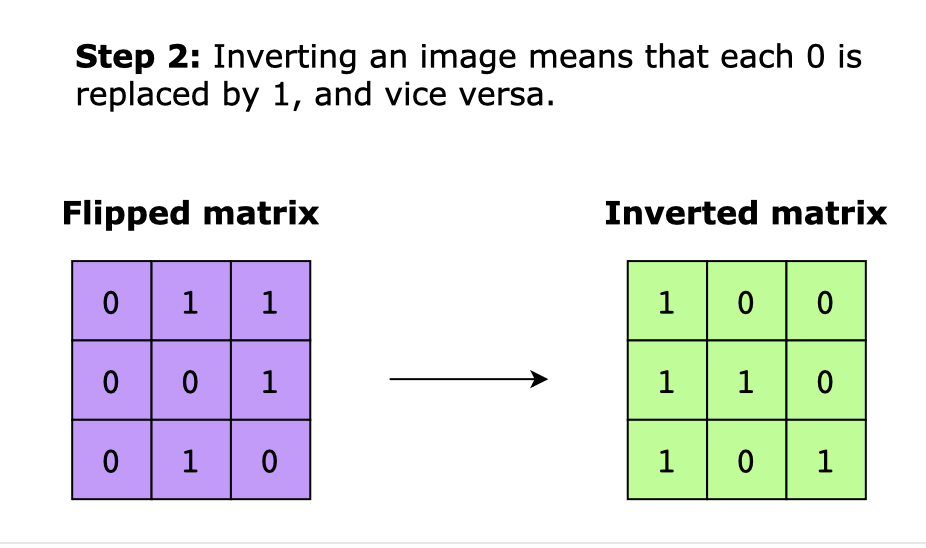

= Matrices
:icons: font

[Overview of Matrices Pattern%collapsible]
Matrix is a 2-dimensional group of numbers arranged in rows and columns (m x n), where `m` is the number of rows and `n` is the number of columns. Each element is accessible via row and column indices, with the first index representing the row and the second index representing the column.

*Matrix Transformations* are operations performed on matrices resulting in a new matrix.

[discrete]
== Matrix Transformation Types
[unordered]
*Addition and Subtraction*:: Performs element-wise addition or subtraction between two matrices of the same dimensions.
*Multiplication*:: Performs dot product between rows of first matrix (`m1`) and columns of second (`m2`), calculated by multiplying corresponding elements of `m1` row and corresponding `m2` column and summing results.
*Inverse*:: For square matrix `A`, if there exists a matrix `B` such that `A * B = B * A = I` (where `I` is the identity matrix), then `B` is the inverse of `A`.
*Transpose*:: Swapping rows and columns of matrix.
*Scalar Multiplication*:: Each element of matrix is multiplied by scalar value.
*Rotation*:: Elements of square matrix rotated at angle.
*Reflection*:: Elements of matrix reflected across an axis.

[discrete]
== Matrix Traversal
*Matrix Traversal* is process or systematic way of visiting each element of matrix exactly once and is used for applications like searching, sorting, pathfinding and data manipulation.

[discrete]
=== Matrix Traversal Techniques
[unordered]
*Row-major traversal*:: [.small]#Traverses matrix row by row, moving horizontally before moving vertically#
*Column-major traversal*:: [.small]#Traverses matrix depth by depth (or col by col), moving vertically before moving horizontally#
*Diagonal traversal*:: [.small]#Traverses along diagonal elements (e.g., top-left -> bottom-right, top-right -> bottom-left, etc.)#
*Spiral traversal*:: [.small]#Traverses matrix in a spiral pattern starting from outermost elements and moving inwards. Direction changes between right, down, left, and up until all elements are visited.#

.How to Rotate and Invert a Matrix
====
Given an n x n binary image, rotate it clockwise, invert and return.

.rotate-clockwise

.invert
image::matrix_inverted.png[Invert, width=200]
====

== Characteristics of Matrices Pattern
***
:tip-caption: 💡
ifdef::env-github[]
:tip-caption: :bulb:
endif::env-github[]
ifdef::env-asciidoctor[]
:tip-caption: :bulb:
endif::env-asciidoctor[]

TIP: Use pattern when problem matches criteria outlined below.

*2D array input*: Input data is 2-dimensional array.

== Problems Solved Using Matrices Pattern
[unordered]
link:ConvertArraytoMatrix.java[Convert Array to Matrix]:: [.small]#Convert 1-dimensional array into 2-dimensional matrix.#
link:CountNegativeNumbersInSortedMatrix.java[Count Negative Numbers in Sorted Matrix]:: [.small]#Count negative numbers in a sorted matrix.#
link:IslandPerimeter.java[Island Perimeter]:: [.small]#Calculate the perimeter of islands using matrices.#
link:MinimumTimeToReachDestination.java[Minimum Time to Reach Destination]:: [.small]#Find minimum time to reach destination using matrices.#
link:RotateImage.java[Rotate Image]:: [.small]#Rotate image 90 degrees clockwise.#
link:SetMatrixZeroes.java[Set Matrix Zeroes]:: [.small]#Set entire row and column to zero if element is zero.#
link:SmallestRectangleEnclosingBlackPixels.java[Smallest Rectangle Enclosing Black Pixels]:: [.small]#Find smallest rectangle enclosing all black pixels.#
link:SpiralMatrix.java[Spiral Matrix]:: [.small]#Traverse matrix in spiral order.#
link:SpiralMatrixII.java[Spiral Matrix II]:: [.small]#Generate matrix in spiral order.#
link:TransposeMatrix.java[Transpose Matrix]:: [.small]#Transpose matrix.#
link:WhereWilltheBallFall.java[Where Will the Ball Fall]:: [.small]#Determine path of ball in matrix.#

== Real World Applications of Matrices Pattern
[unordered]
*Image processing*:: [.small]#Matrices used to represent images, where matrix is used to store pixel color values. Matrix transformations like scaling, rotation, translation, and affine transformations are applied to manipulate images in graphics software.#
*Computer graphics and gaming*:: [.small]#Matrices used to represent transformations, e.g., translating, rotating, scaling, etc., in 3-Dimensional space and for transformations of vertices in 3D graphic-rendering pipelines, which are essential in creating hyper-realistic video games and simulations.#
*Data analysis and statistics*:: [.small]#Matrices used in statistics to represent sets of data, specifically in techniques like linear regression, principal component analysis (PCA), and factor analysis. They also play a crucial role in multivariate analysis, covariance matrices, and correlation matrices.#
*Machine learning*:: [.small]#Matrices central to many machine learning algorithms, especially in tasks like linear regression, logistic regression, support vector machines (SVM), neural networks, and dimensionality reduction techniques.#
