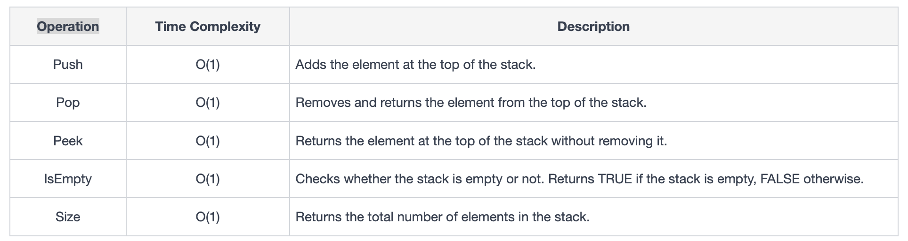

= Stacks
:icons: font

[Overview of Stacks Pattern%collapsible]
Stacks are linear data structures used to organize and manage data using a "Last In, First Out (LIFO)" process pattern.

Fundamental operations of the Stack are `push` and `pop`, used to add and remove elements accordingly while maintaining LIFO order.

An important property of Stack is `capacity` which is its size. Vital to track stack capacity while performing to avoid stack overflows or underflows.

.Operations on Stacks
====
.Table of Stack Operations

====

.Stack Implementation
====
Implemented using either `array` or `linked list` data structures:
[unordered]
*Array Implementation*:: [.small]#Stack represented as fixed size array where elements are added and removed from one end and pointer used to tract top.#
*Linked List Implementation*:: [.small]#Stack elements represented as node in linked list and top of stack is head of list.#
====

== Characteristics of Stacks Pattern
***
:tip-caption: 💡
ifdef::env-github[]
:tip-caption: :bulb:
endif::env-github[]
ifdef::env-asciidoctor[]
:tip-caption: :bulb:
endif::env-asciidoctor[]

TIP: Use when problem matches criteria outlined below.

[unordered]
*Reverse order processing*:: [.small]#involves processing elements in reverse order or last element added must be processed first.#
*Nested structures handling*:: [.small]#involves nested structures, e.g., brackets, parentheses, nested function calls.#
*State tracking*:: [.small]#requires keeping track of previous states or undoing operations.#
*Expression evaluation*:: [.small]#involves evaluating expressions.#
---
Conditions NOT matching criteria for solving with Stacks:
[unordered]
*Order dependence*:: [.small]#requires either a different order dependence than Last In, First Out (LIFO) or there is no order dependency at all.#
*Random access*:: [.small]#involved frequent access or modification of elements at arbitrary positions is needed and not just from the end.#
*Need for searching*:: [.small]#requires efficient searching for elements based on values or properties.#
***

== Problems Solved Using Stacks Pattern
[unordered]
link:BasicCalculator.java[Basic Calculator] [.small]#Evaluate the value of an arithmetic expression in Reverse Polish Notation (RPN).#
link:DailyTemperatures.java[Daily Temperatures] [.small]#Find how many days you would have to wait until a warmer temperature.#
link:DecodeString.java[Decode String] [.small]#Decode a string encoded with a special encoding scheme.#
link:EvaluatePostfixExpression.java[Evaluate Postfix Expression] [.small]#Evaluate the value of an arithmetic expression in Postfix notation.#
link:ExclusiveTimeOfFunctions.java[Exclusive Time of Functions] [.small]#Calculate the exclusive time of functions.#
link:FlattenNestedListIterator.java[Flatten Nested List Iterator] [.small]#Flatten a nested list and iterate over it.#
link:ImplementQueueUsingStacks.java[Implement Queue using Stacks] [.small]#Implement a queue using two stacks.#
link:MinimumRemovalsToMakeValidParentheses.java[Minimum Removals to Make Valid Parentheses] [.small]#Remove the minimum number of parentheses to make the input string valid.#
link:RemoveAllAdjacentDuplicatesInString.java[Remove All Adjacent Duplicates In String] [.small]#Remove all adjacent duplicates in a string.#
link:ValidParentheses.java[Valid Parentheses] [.small]#Check if the input string is valid.#

== Real World Applications of Stacks Pattern
[unordered]
*Function call stack*:: [.small]#Stacks used to manage function calls in programming languages. When function called context pushed onto stack and when function completes, it is popped.#
*Text editor undo/redo feature*:: [.small]#Stacks used to undo/redo changes made during editing. Each edit operation is pushed onto stack, allowing users to revert to previous state by popping most recent edit.#
*Browser back and forward buttons*:: [.small]#Back and forward navigation in web browsers implemented using a stack to track visited pages. Clicking back button pops current page while clicking forward button pushes it onto stack.#
*Call history in smartphones*:: [.small]#Maintainence of call history stack allows users to navigate through recent calls.#
*Expression evaluation*:: [.small]#Stacks used to store elements with sequential dependencies in mathematical expressions. `2+3×7` Stack used to enforce order of operations.#
*Transaction history in banking apps*: [.small]#Stacks help maintain secure and ordered transaction histories.  Transactions are pushed onto stack at once ensuring that most recent transaction is always the most easily accessible.#